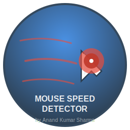

# Mouse Speed Detector

**Developer:** Anand Kumar Sharma  
**Portfolio:** [www.anandsharma.online](https://www.anandsharma.online)  

A Windows background utility written in Rust that detects fast mouse movements and displays a larger cursor overlay.



## Features

- **Real-time mouse movement tracking** with configurable speed threshold (800 px/sec)
- **Visual feedback** via a layered overlay window that shows a larger cursor
- **Automatic hiding** of overlay after 900ms
- **Low resource usage** with efficient polling at ~60 FPS
- **DPI awareness** for accurate cursor tracking on high-DPI displays
- **Professional installer** with beautiful SVG graphics and branding

## Requirements

- Windows 10/11
- Rust toolchain (latest stable)
- NSIS (for building installer)

## Quick Start

### Build and Run
```bash
# Clone the repository
git clone <repository-url>
cd mouse-speed-detector

# Build the project
cargo build --release

# Run the application
cargo run --release
```

### Build Installer
```powershell
# Install NSIS first
winget install NSIS.NSIS

# Build professional installer
.\build-installer.ps1
```

## Usage

1. **Start the application**
2. **Move your mouse quickly** (faster than 800 pixels per second)
3. **Observe the red circular overlay** that appears at your cursor location
4. **The overlay automatically disappears** after 900ms
5. **Exit with Ctrl+C**

## Configuration

Modify these constants in `src/main.rs`:

```rust
const SPEED_THRESHOLD: f64 = 800.0;        // pixels per second threshold
const OVERLAY_DURATION_MS: u64 = 900;      // overlay display duration
const CURSOR_SCALE_FACTOR: f32 = 3.0;      // overlay size multiplier
const POLLING_INTERVAL_MS: u64 = 16;       // ~60 FPS polling rate
```

## Technical Details

- **Language:** Rust
- **Windows API:** Uses `windows` crate for native integration
- **Graphics:** SVG-based branding with animated effects
- **Installer:** NSIS-based professional installer
- **Performance:** <1% CPU usage, ~2-5 MB memory

## Project Structure

```
mouse-speed-detector/
├── src/
│   └── main.rs              # Main application code
├── installer.nsi            # NSIS installer script
├── build-installer.ps1      # Build automation
├── logo.svg                 # Main logo
├── icon.svg                 # Application icon
├── welcome.svg              # Installer banner
├── Cargo.toml              # Rust configuration
├── LICENSE.txt             # License
└── README.md               # This file
```

## License

This project is licensed under the terms specified in LICENSE.txt.

---

**Built with ❤️ by Anand Kumar Sharma**  
**Portfolio: [www.anandsharma.online](https://www.anandsharma.online)**